# AI-Enabled Intrusion Detection and Adaptive Heterogeneous D2D Communication Framework

**Authors:** Siddharth Anand & Tathagat Parashar[cite: 2]  
**Institution:** Vellore Institute of Technology (VIT), School of Electronics Engineering[cite: 2]

## Project Overview
This repository contains the simulation models, cryptographic scripts, and deep learning architectures for a multi-layered security framework designed for 5G and Beyond 5G (B5G) Vehicular Ad-hoc Networks (VANETs)[cite: 2]. By leveraging decentralized Device-to-Device (D2D) communication, this system addresses the latency constraints of traditional cellular infrastructure while mitigating the unique security vulnerabilities of open vehicular networks[cite: 2]. 

To overcome the inherent "Security-Latency Trade-off," this project integrates an adaptive physical-layer link selection protocol, a lightweight 256-bit Elliptic Curve Diffie-Hellman (ECDH) cryptographic foundation, and an AI-driven CNN-LSTM behavioral intrusion detection system[cite: 2].

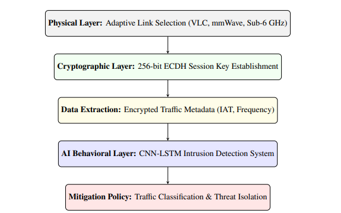 
*Figure 4: Comprehensive Multi-Layered Security Workflow mapping the transition from physical channel routing to deep-learning threat mitigation.*[cite: 2]

---

## Multi-Layered Defense Architecture

### 1. Adaptive Link Selection (Physical Layer)
The framework utilizes a multi-interface On-Board Unit (OBU) to dynamically switch between three spectrum layers based on real-time Signal-to-Noise Ratio (SNR) and inter-vehicular distance[cite: 2]:

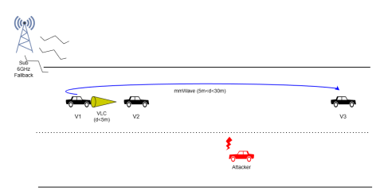 
*Figure 1: Proposed Heterogeneous VANET Architecture illustrating dynamic D2D interactions across VLC, mmWave, and Sub-6 GHz transmission layers.*[cite: 2]

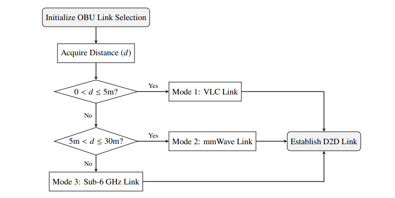 
*Figure 2: Decision Flowchart representing the adaptive heterogeneous link selection logic based on real-time inter-vehicular distance constraints.*[cite: 2]

*   **Mode 1 (Visible Light Communication - VLC):** Optimal for strict Line-of-Sight (LoS) distances under 5 meters, ensuring high throughput and physical security[cite: 2].
*   **Mode 2 (mmWave):** Utilizes the 28 GHz frequency for medium-range connectivity between 5 and 30 meters[cite: 2].
*   **Mode 3 (Sub-6 GHz):** Serves as a reliable fallback for Non-Line-of-Sight (NLOS) and long-range excursions exceeding 30 meters[cite: 2].

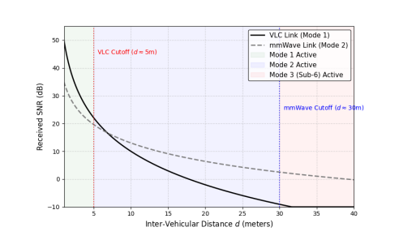 
*Figure 3: Comparative SNR decay analysis mapping the sharp degradation of VLC against the sustained viability of mmWave over distance.*[cite: 2]

### 2. Lightweight Cryptography (Session Layer)
*   Implements an optimized 256-bit ECDH key exchange on the NIST p256 curve (secp256r1)[cite: 2].
*   Provides security parity with legacy 3072-bit RSA frameworks while drastically reducing the computational burden on resource-constrained OBUs[cite: 2].

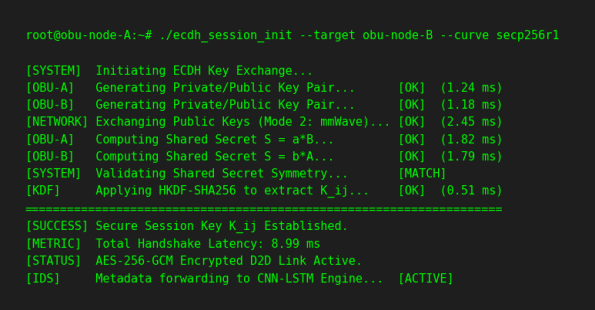 
*Figure 6: Log of successful ECDH handshake showing public key exchange and shared secret derivation times in milliseconds.*[cite: 2]

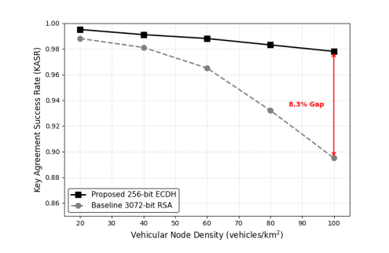 
*Figure 10: Comparative analysis of Key Agreement Success Rate (KASR) under scaling vehicular node densities, illustrating the resilience of the proposed ECDH-256 framework.*[cite: 2]

### 3. AI-Driven Intrusion Detection (Behavioral Layer)
The system features a hybrid CNN-LSTM deep learning engine that analyzes encrypted traffic metadata, completely bypassing the massive processing overhead of Deep Packet Inspection (DPI)[cite: 2].

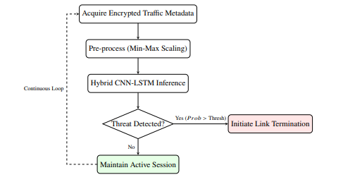 
*Figure 5: Logic flow of the OBU-side security execution, from signal acquisition to automated threat mitigation.*[cite: 2]

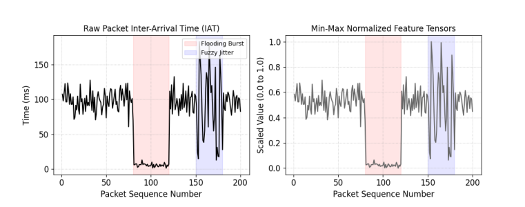 
*Figure 7: Visualization of raw packet Inter-Arrival Times (IAT) versus the Min-Max Normalized Feature Tensors utilized as direct input for the CNN-LSTM architecture.*[cite: 2]

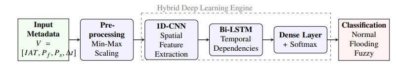 
*Figure 8: Architectural composition of the hybrid CNN-LSTM framework, demonstrating the layer-by-layer sequence from raw metadata ingestion to precise threat classification.*[cite: 2]

---

## Threat Mitigation Performance
The system addresses multiple threat vectors without requiring payload decryption[cite: 2]:

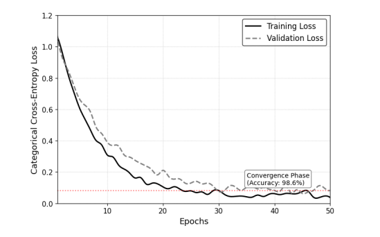 
*Figure 9: Empirical training and validation loss curves indicating the fast convergence and lack of overfitting of the deployed CNN-LSTM model.*[cite: 2]

*   **Flooding & DoS Attacks:** Detected via LSTM temporal tracking of packet bursts, achieving a **98.6% overall accuracy**[cite: 2].
*   **Fuzzy Injection:** Identified with a remarkably low False Negative Rate (FNR) of **1.9%**, far surpassing baseline Random Forest (11.6%) and standard LSTM (7.9%) models[cite: 2].

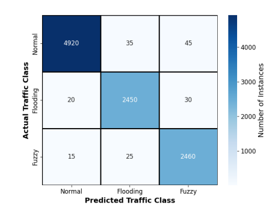 
*Figure 11: Confusion matrix confirming precise threat classification with a 1.9% False Negative Rate against obfuscated fuzzy attacks.*[cite: 2]

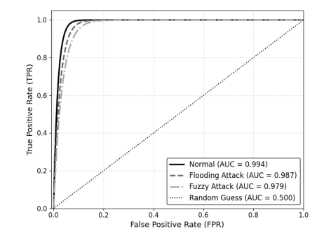 
*Figure 12: Receiver Operating Characteristic (ROC) curves and corresponding AUC scores proving the absolute classification superiority of the CNN-LSTM framework across diverse threat vectors.*[cite: 2]

---

## Repository Structure
*   `/ai_ids_model`: Contains the TensorFlow/Keras implementation of the hybrid CNN-LSTM architecture and data preprocessing scripts for Min-Max scaling[cite: 2].
*   `/crypto_module`: Python scripts executing the ECDH session initialization, parameter consensus, and HKDF-SHA256 key extraction[cite: 2].
*   `/ns3_simulations`: Network simulation configurations mapping vehicular mobility and link-state dynamics across 5.9 GHz, 28 GHz, and 400-800 THz spectrums[cite: 2].
*   `/docs`: System architecture flowcharts, mathematical performance graphs, and evaluation logs[cite: 2].
